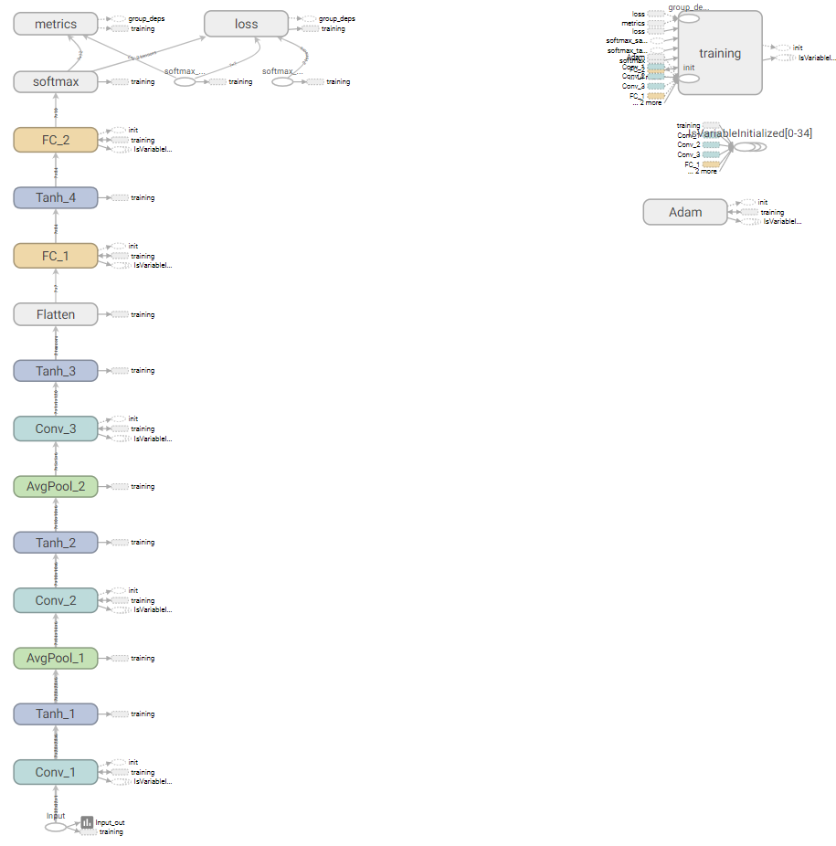
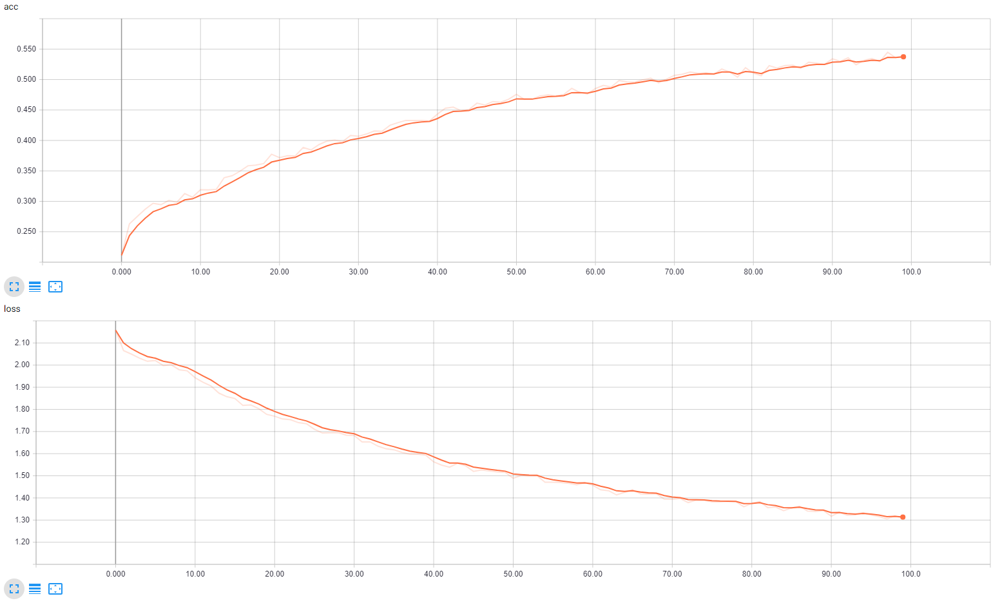
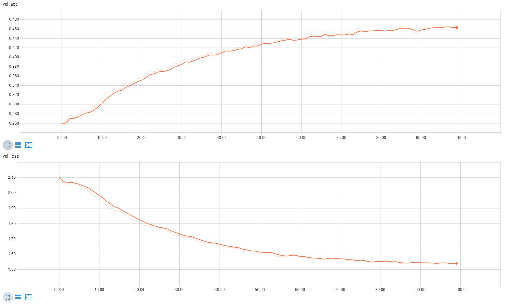

# LeNet in Keras

## Description
Implementation of LeNet architecture in Keras

## Files
* `config.json`: Configuration file to store variables and paths
* `data_loader.py` : DataLoader class responsible for all data handling and provides generator that will be used for the training process
* `model.py`: Construct LeNet class with forward pass and optimizer 
* `trainer.py` : Trainer class used for training with callbacks and evaluate test set 
* `main.py`: Main file, includes training and evaluation of data

## Run 
To run the files, use `python main.py`, modify `config.json` if needed.

## Tensorboard
Tensorboard is TensorFlow's visualization tool, we can use it in Keras by calling 
it in the callbacks.

To access Tensorboard, run in the terminal 

`tensorboard --logdir tensorboard/LeNet_tf/` 

then go to `localhost:6006` in your web browser.

### Graph 
In this section, the neural network graph is created.

	

### Scalars
We can observe both the accuracy and loss for the training and the validation set 
automatically. 

  

  

