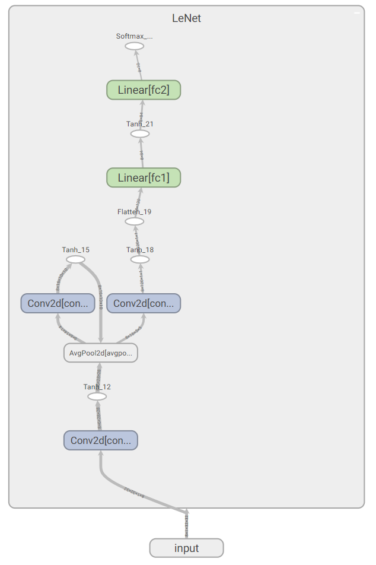
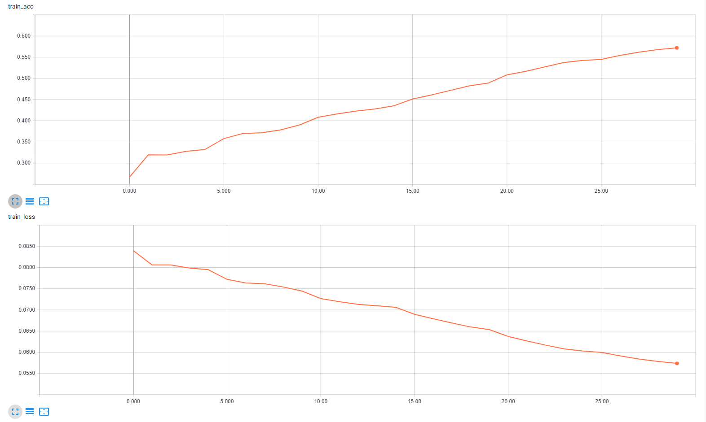
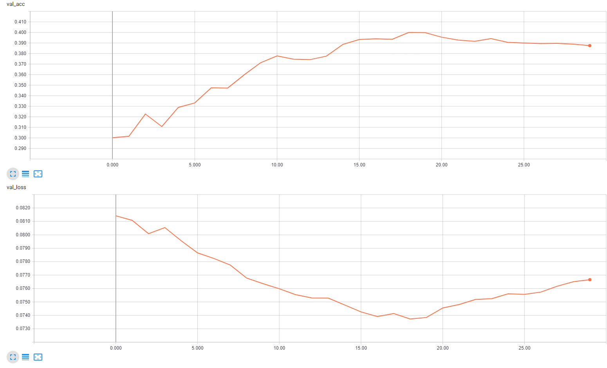

# LeNet in PyTorch

## Description
Implementation of LeNet architecture in PyTorch

## Files
* `config.json`: Configuration file to store variables and paths
* `data_loader.py` : DataLoader class responsible for all data handling and provides generator that will be used for the training process
* `model.py`: Construct LeNet class with forward pass and optimizer 
* `trainer.py`: Trainer class used for training and evaluation of test and validation set, includes saver
* `main.py`: Main file for loading, training, evaluate and saving data

## Run 
To run the files, use `python main.py`, modify `config.json` if needed.

## Tensorboard
Tensorboard, the visualization originally from TensorFlow is compatible with
Pytorch thanks to **tensorboardX**

To access the visualizations run in the terminal

`tensorboard --logdir tensorboard/LeNet_exp/`

### Graph
The neural network architecture is created based on the implementation in `model.py`

  

### Scalars
We can observe both the accuracy and loss for the training and the validation set 

  

  

## Performance
On the test dataset, the accuracy is 40.5 % 