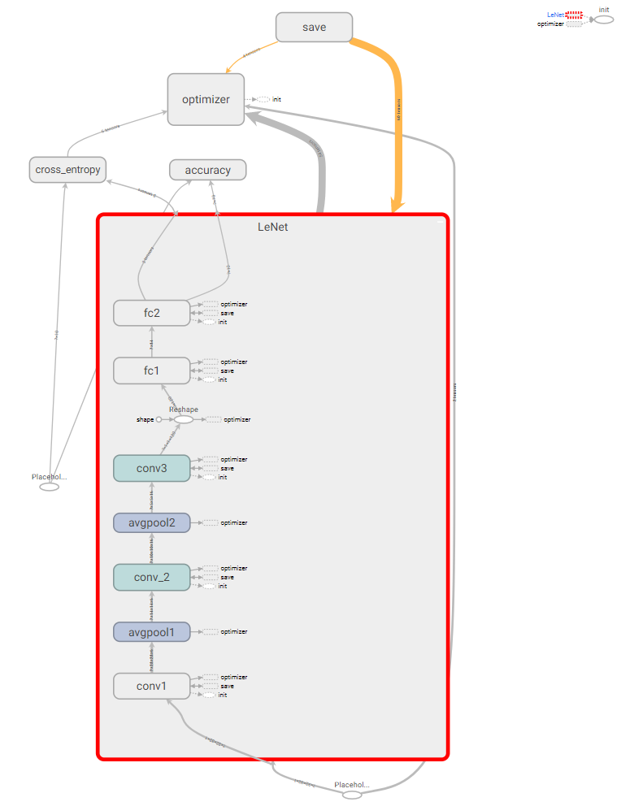
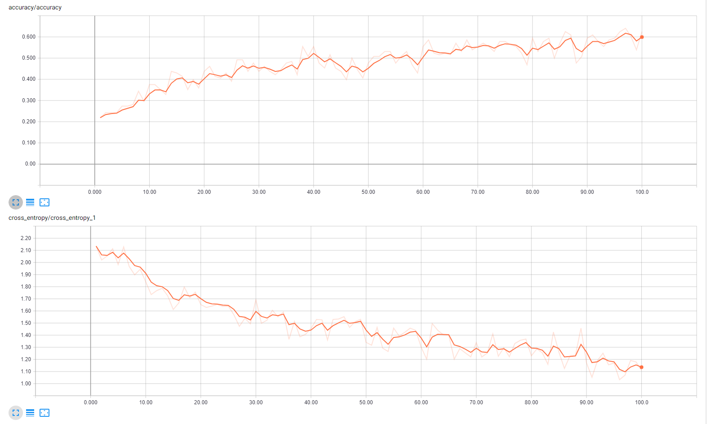
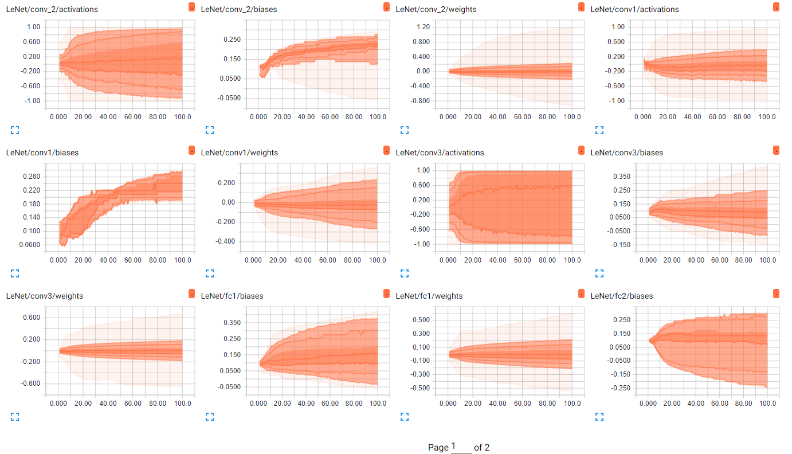
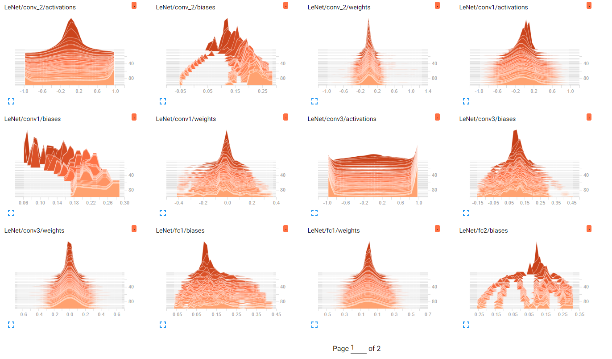

# TensorFlow LeNet 

## Description
Implementation of LeNet architecture in TensorFlow

## Files
* `config.json`: Configuration file to store variables and paths
* `data_loader.py` : DataLoader class responsible for all data handling and provides generator that will be used for the training process
* `model.py`: Construct LeNet class with forward pass and optimizer 
* `metrics.py` : Provide metrics useful for Tensorboard and training 
* `main.py`: Main file, includes training and evaluation of data

## Run 
To run the files, use `python main.py`, modify `config.json` if needed.

## Tensorboard
To access Tensorboard visualization tool, run in the terminal 

`tensorboard --logdir tensorboard/LeNet_tf/` 

then go to `localhost:6006` in your web browser and there it is.

### Graph 
The neural network architecture is created with proper `variable_scope`, 
for a more comprehensible graph. 

Note that same blocks will be displayed with the same color.

  

### Scalars
By creating a `tf.summary.scalar` for the metrics, we can visualize them 
while the network is in its training phase, or later. 

  

### Distributions / Histograms

We can also add visualizer to inspect the weights, bias and activations of
each layer to ensure that there is no issue.

Distributions overview: 

  

Histograms overview:

  

